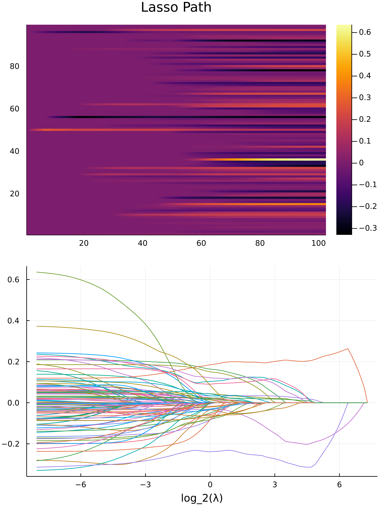

# LassoPath

### **Intro**

Before the creation of this project, I already had a prototype. 

This is created via `PkgTemplate.jl`, this is the package template creator for this project. 

The workflow of the project will be boosted by `Revise.jl`. 


---
### **LassoPath**

Change the value of the L1 regularization until the solution reaches zero, then the values for predictors, or the weights of the regression parameters are identified. 

The most important parameters are the ones that still stays as the penalization gets bigger. 

**Approach: Conic Programming**: 
1. Phrase the lasso problem as a quadratic programming problem
2. solve it with different parameters of lambda, with a warm start on the solver. 

**Problem**:
* This is going to be slow because the solver is single threaded (COSMO supports multi-threading, but they claim it's not too stable), and it's not an interior points based method, it's a much general one, it's an ADMM based conic programming solver. An QP solver might be more better for Lasso type of problem. 

* It's kinda redundant because it modifies the model for the solver each time. 

**Warning** 

The `JuMP.jl` frame work is EXTREMELY slow if you have big data, please avoid at all cost. 

For Lasso I implemented by self-made Proximal Accelerated Graidient (FISTA), and it 's about 500 times faster than the quadratic solver, with better numerical precision too. 

---
### **Usage Examples**

The crime dataset is analyzed in the file [here](./usage_examples/crime_data/data_analyze.jl), where we created the lasso path plot: 

 

and the top predictors for crime rate over a county are identified to be: 

```
 "PctKids2Par"       "-"
 "PctIlleg"          "+"
 "racePctWhite"      "-"
 "HousVacant"        "+"
 "MalePctDivorce"    "+"
 "PctPersDenseHous"  "+"
 "pctUrban"          "+"
 "PctHousOccup"      "-"
 "PctVacantBoarded"  "+"
 "racepctblack"      "+"
```

And these predictor's description is: 


```
-- PctKids2Par: percentage of kids in family housing with two parents (numeric - decimal)
-- PctIlleg: percentage of kids born to never married (numeric - decimal)
-- racePctWhite: percentage of population that is caucasian (numeric - decimal)
-- HousVacant: number of vacant households (numeric - decimal)
-- MalePctDivorce: percentage of males who are divorced (numeric - decimal)
-- PctPersDenseHous: percent of persons in dense housing (more than 1 person per room) (numeric - decimal)
-- pctUrban: percentage of people living in areas classified as urban (numeric - decimal)
-- PctHousOccup: percent of housing occupied (numeric - decimal)
-- PctVacantBoarded: percent of vacant housing that is boarded up (numeric - decimal)
-- racepctblack: percentage of population that is african american (numeric - decimal)
```

The usage for the package is simple, and it's like: 

```julia
# Analyze the data using Lasso Path pacakge I wrote. 
cd("C:\\Users\\victo\\source\\repos\\Silly_Julia_stuff\\Julia Packages\\LassoPath\\usage_examples\\crime_data")
using DelimitedFiles, CSV, DataFrames
using LassoPath
using BenchmarkTools

Df = CSV.read("process_data.csv", DataFrame)
Df = Df[!, Not([:state, :fold])]

# Extrac Numerics, predictors, predictants. 
A, b = Matrix(Df[:, Not(end)]), Df[:, end]

PrintTitle("The Data is ready, we are ready for analyais now")

function ShowResults(constructor::Function, fname::String)
    lassoIntance = constructor(A, b)
    GetLassoPath(lassoIntance)
    VisualizeLassoPath(lassoIntance, fname=fname)
    predictorIndices, λ, ws = 
        CaptureImportantWeights(lassoIntance, 10, 1e-2)
    PrintTitle("Important Predictors are")
    predictors = names(Df[:, Not(end)])[predictorIndices]
    impacts = map(ws) do x
        if x >= 0 
            return "+"
        else 
            return "-"
        end
    end
    display([reshape(predictors, :) reshape(impacts, :)])
end

# @time ShowResults((x, y) -> LassoSCOP(x, y), "Lasso SCOP.png")
@time ShowResults((x, y) -> LassoProximal(x, y), "Lasso Proximal.png")


```

Nice and easy code. 


> Lasso is cool because by looking at the graph, one can deduce the covariance and colinearirity between the weights for the gression. 


